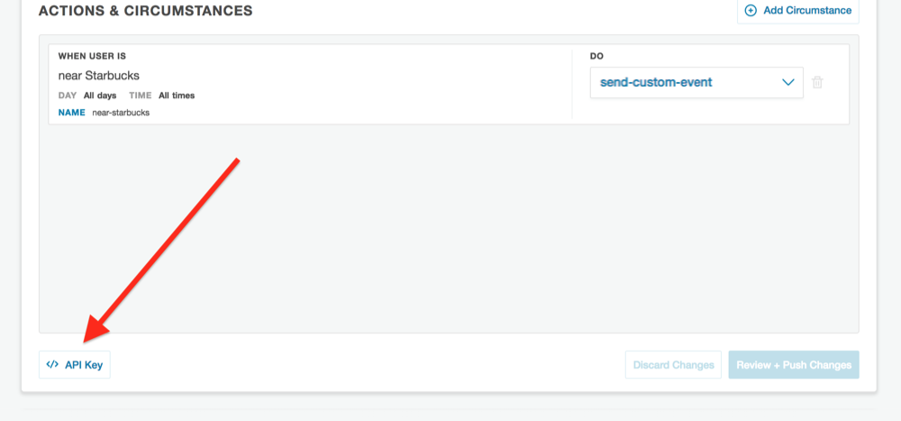

# Example

## Setup

### Install the Cocoapod

```
pod install
```

### Configuration

**(1)** Locate your Factual Engine API Key from the [Factual Engine Dashboard](https://engine.factual.com/garage)



**(2)** Add your Factual Location Engine API Key to Configuration.m at `engineApiKey` in place of where it says "Your Engine API Key here".

**(3)** Locate your Braze SDK API Key for your app from the [Braze Dashboard](https://dashboard.braze.com) in **Developer Console** under the **APP SETTINGS** tab.  Go to **Identification** and use the API Key listed for your app.

**(4)** Add your Braze API Key to Configuration.m at `brazeApiKey` in place of where it says "Your Braze API Key here"

**(5)** Determine your [Braze Endpoint](https://www.braze.com/docs/developer_guide/rest_api/basics/#what-is-a-rest-api) and determine your [Braze SDK Endpoint](https://www.braze.com/docs/user_guide/administrative/access_braze/sdk_endpoints/).

**(6)** Add your Braze SDK Endpoint to Configuration.m in place of where it says "Your Braze SDK Endpoint here"

**(7)** Enter a new User ID in Configuration.m where it says "Your Braze User ID here" and enter an email in Configuration.m where it says "Your Braze User Email here" (user ID and email does not need to be signed up to Braze, this is just used to lookup a user on the Braze Dashboard)

**(8) -(optional)-** Enable push notifications for this app.  To do so, you must [enable push notifications](https://developer.apple.com/documentation/usernotifications/registering_your_app_with_apns) and configure your [Apple Developer Account](https://developer.apple.com/account/#/overview/) to allow push notifications.

### Testing

If you'd like to test the integration, an example test is given.  To run the test, fill out your information in StubConfiguration.m.  Change the `testLatitude` and `testLongitude` variables to coordinates of a place which would trigger your Engine Circumstance.  Your `brazeRestEndpoint` is the same as your SDK Endpoint after replacing 'sdk' with 'rest'.

### Explore

From here, you can setup Braze to trigger actions based on Engine custom events.  [See here](https://github.com/Factual/engine-braze-integration#example) for an example of sending a push notification when a user visits a coffee shop.
