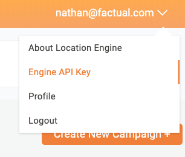

# Example

## Setup

### Install the Cocoapod

```
pod install
```

### Configuration

**(1)** Locate your Factual Engine API Key from the [Factual Engine Dashboard](https://engine.factual.com/)



**(2)** Add your Factual Location Engine API Key to [Configuration.m](https://github.com/Factual/engine-braze-integration-ios/blob/master/example/BrazeFactualEngineDemo/Configuration.m#L15).

**(3)** Locate your Braze SDK API Key for your app from the [Braze Dashboard](https://dashboard.braze.com) in **Developer Console** under the **APP SETTINGS** tab.  Go to **Identification** and use the API Key listed for your app.

**(4)** Add your Braze API Key to [Info.plist](https://github.com/Factual/engine-braze-integration-ios/blob/master/example/BrazeFactualEngineDemo/Info.plist#L8)

**(5)** Determine your [Braze Endpoint](https://www.braze.com/docs/user_guide/administrative/access_braze/sdk_endpoints/) and add it to [Configuration.m](https://github.com/Factual/engine-braze-integration-ios/blob/master/example/BrazeFactualEngineDemo/Configuration.m#L23).

**(6)** Enter a new User ID in [Configuration.m at `brazeUser`](https://github.com/Factual/engine-braze-integration-ios/blob/master/example/BrazeFactualEngineDemo/Configuration.m#L27) and a test user email in [Configuration.m at `brazeUserEmail`](https://github.com/Factual/engine-braze-integration-ios/blob/master/example/BrazeFactualEngineDemo/Configuration.m#L31).

**(7) -(optional)-** Enable push notifications for this app.  To do so, you must [enable push notifications](https://developer.apple.com/documentation/usernotifications/registering_your_app_with_apns) and configure your [Apple Developer Account](https://developer.apple.com/account/#/overview/) to allow push notifications.

### Explore

From here, you can setup Braze to trigger actions based on Engine custom events.  [See here](https://github.com/Factual/engine-braze-integration#example) for an example of sending a push notification when a user is near a coffee shop.

### Testing

If you'd like to test the integration, an example test is given.  To run the test, fill out your information in [StubConfiguration.m](https://github.com/Factual/engine-braze-integration-ios/blob/master/example/BrazeFactualEngineDemoTests/StubConfiguration.m), change the `testLatitude` and `testLongitude` variables to coordinates of a place which would trigger your Engine Circumstance, and add your Braze Endpoint to the test's [Info.plist](https://github.com/Factual/engine-braze-integration-ios/blob/master/example/BrazeFactualEngineDemoTests/Info.plist#L8)
